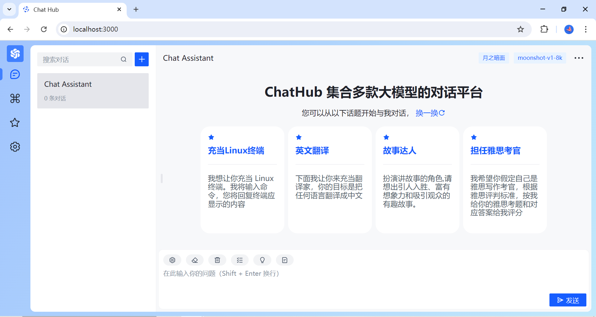

<h1 align="center">ChatHub</h1>
<h3 align="center">
基于Vue3的大模型问答UI，支持OpenAI、月之暗面、智谱清言、天工开物、百川智能、讯飞星火、百度文心、阿里通义、阶跃星辰、深度求索API模型，支持Ollama本地模型
</h3>



## 🖥️ 功能介绍

### 1. 强大的AI能力支撑

轻松接入多个厂商的大模型API。

### 2. 丰富的配置

多语言、多主题配置。

## ⚒️ 项目开发

### 安装依赖

```sh
npm install
```

### 启动

```sh
npm run dev
```

### 构建项目

```sh
npm run build
```

## 引用与致谢

在[AIHUB](https://github.com/classfang/AIHub)项目上进行二次开发！主要是记录自己向大神的学习过程！
